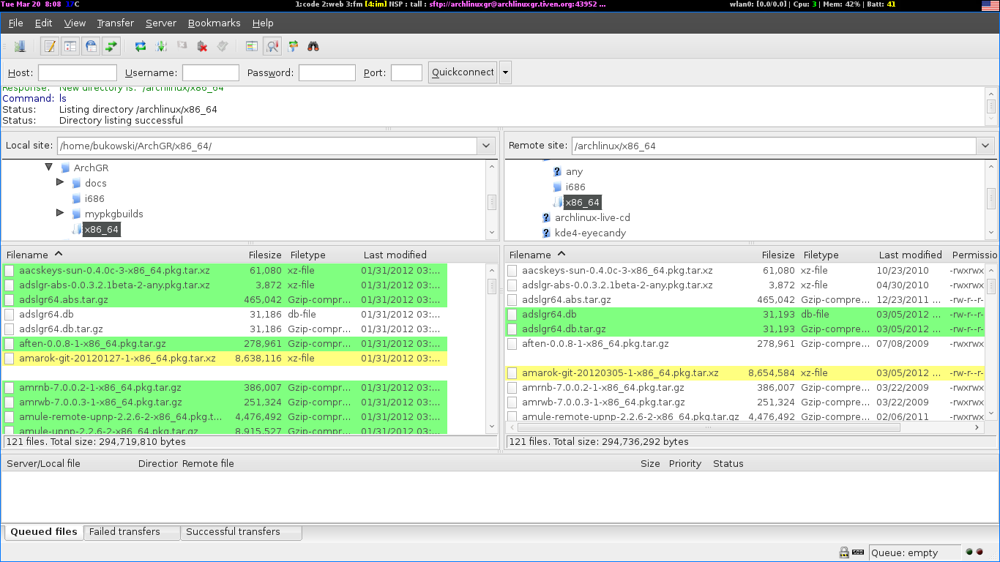

================================================================
Ανεβάζοντας τα χτισμένα πακέτα και τις βάσεις στον remote server
================================================================

Ο server μάς παραχωρείται από τον Tiven τον οποίο ευχαριστούμε πολύ. Επειδή όμως δεν τρέχει arch αλλά debian, οι βάσεις χτίζονται τοπικά από τον καθένα μας και ανεβάζονται στον server μαζί με τα πακέτα που συντηρούμε. Για αυτό το σκοπό θα χρησιμοποιήσουμε το γνωστό filezilla και θα συνδεθούμε μέσω sftp. Τα στοιχεία πρόσβασης θα αποσταλούν με ταχυδρομικό περιστέρι στον κάθε maintainer, ώστε να αποφύγουμε το ενδεχόμενο να διαρρεύσουν. 

Δουλεύοντας με το filezilla
---------------------------

Αρχικά προφανώς το εγκαθιστούμε με ::

  pacman -S filezilla

Η γενική χρήση του είναι ότι με διπλό κλικ ανεβαίνει/κατεβαίνει ένα αρχείο, ανάλογα σε ποιο panel είμαστε. Πολλαπλά αρχεία ανεβαίνουν/κατεβαίνουν με ``drag & drop``.

Πρώτη επαφή
-----------

Με τα στοιχεία πρόσβασης που μας έχουν σταλεί, κάνουμε login στον server. Αν συνδεόμαστε για πρώτη φορά, περιηγούμαστε στο φάκελο ``archlinux`` και κατεβάζουμε τους φακέλους ``i686 x86_64 any``. Για λόγους ευχρηστίας καλό είναι να φτιάξουμε ένα directory  στο ``/home`` μας, όπου θα έχουμε μαζεμένα τα repositories καθώς και τα PKGBUILDs που θα χειριζόμαστε με το git. Ένα παράδειγμα είναι το παρακάτω\: ::

	$HOME/ArchGr
		|
		|-- repo
		|    |
		|    |-- i686
		|    |
		|    |-- x86_64
		|    |
		|    `-- any
		|
		`-- pkgbuilds

Σύγκριση local/remote πακέτων
-----------------------------

Αφού χτίσουμε τα πακέτα που θέλουμε να ανεβάσουμε, η πρώτη μας δουλειά είναι να συγχρονίσουμε τα πακέτα που ήδη υπάρχουν στο repository, καθώς είναι πολύ πιθανόν πριν από μας να έχει ανεβάσει κάποιος άλλος τα δικά του. Επιλέγουμε λοιπόν στην αριστερή μπάρα το local repo και στη δεξιά το remote. Πατάμε το τρίτο εικονίδιο από τα δεξιά (ένας μεγενθυντικός φακός) και αν υπάρχουν αλλαγές στο remote, θα εμφανιστούν με κίτρινο χρώμα. Αυτό που πρέπει να κάνουμε είναι να κατεβάσουμε στο local τα νέα/αναβαθμισμένα πακέτα και να σβήσουμε τα παλιά, ώστε στο τέλος τα 2 repositories να περιέχουν ακριβώς τα ίδια πακέτα με ακριβώς τις ίδιες εκδόσεις.

Ανέβασμα πακέτων και βάσεων
---------------------------

Ακολουθώντας τα προηγούμενα βήματα, τα repos είναι ενημερωμένα και είμαστε πλέον έτοιμοι να ανεβάσουμε τα δικά μας πακέτα στον server. Με έναν file manager (ή όπως βολεύει τον καθένα) αντιγράφουμε τα χτισμένα μας πακέτα στο φάκελο της αρχιτεκτονικής που θέλουμε. Έπειτα τρέχοντας την εντολή, πχ για το i686 repository ::
	
		repo-add $HOME/ArchGr/repo/i686/archlinuxgr.db.tar.gz *.tar.*

δημιουργείται η νέα database η οποία περιέχει:

* τα παλιά πακέτα
* τα νέα πακέτα των άλλων maintainers
* τα δικά μας νέα πακέτα

Επόμενο και τελικό βήμα είναι να ανεβάσουμε τα δικά μας πακέτα με τη νέα βάση (2 αρχεία, ``archlinuxgr.db`` και ``archlinuxgr.db.tar.gz``).

