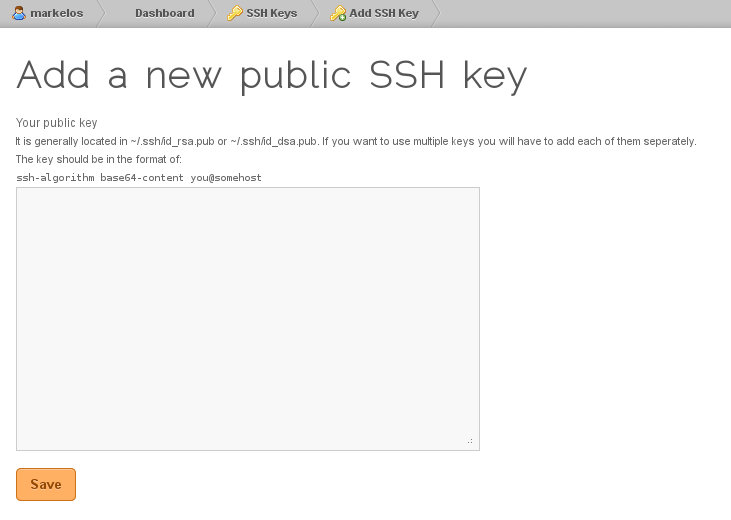

===========================================
Χρήση του git για το tracking των PKGBUILDs
===========================================

Το git είναι ένα εργαλείο της κατηγορίας VCS (Version Control System) που μας βοηθάει να κρατάμε track των αλλαγών που γίνονται σε ένα αρχείο. Γράφτηκε από τον Linus Torlvalds για το track του linux kernel και είναι πλεόν ένα από τα πιο διαδεδομένα εργαλεία collaboration μεταξύ developers σε όλο τον κόσμο. Για τους σκοπούς του άρθρου και του tracking των PKGBUILDs, θα αναφερθούμε μόνο σε όσα μας ενδιαφέρουν. Όποιος επιθυμεί να ψαχτεί παραπάνω υπάρχουν άπειροι οδηγοί στο Internet.

Εγκατάσταση
-----------
Πολύ απλά, δίνοντας:: 

	pacman -S git

εγκαθιστάται το ``git``.

Δημιουργία ssh keys
-------------------
*Αν έχουμε ένα ήδη υπάρχον ζευγάρι κλειδιών που θέλουμε να χρησιμοποιήσουμε, πάμε κατ' ευθείαν στη δήλωση του public key στο gitorious.*

Για να έχουμε write access στο repository του gitorious πρέπει με κάποιο τρόπο να πιστοποιούμε την ταυτότητά μας και ταυτόχρονα να είναι ασφαλές ώστε να μη μπορεί κάποιος τρίτος να αποκτήσει πρόσβαση. Για αυτό το λόγο το git συνεργάζεται με το ssh. 

Για να δημιουργήσουμε ένα ssh key εκτελούμε την παρακάτω εντολή ::

	ssh-keygen -t rsa -C "name@archlinux.gr"

όπου ``name@archlinux.gr`` το mail μας. Μόλις πατήσουμε enter θα μας ρωτήσει πού να σώσει το κλειδί. Γράφουμε όλη τη διαδρομή καθώς και το όνομα του κλειδιού, στην περίπτωσή μας έστω ``gitorious_rsa``. ::

	Generating public/private rsa key pair.
	Enter file in which to save the key (/home/user/.ssh/id_rsa): 
	/home/user/.ssh/gitorious_rsa

Έπειτα θα μας ζητηθεί ένα passphrase. Μπορούμε να το αφήσουμε κενό ώστε κάθε φορά που θα κάνουμε push τις αλλαγές μας στο gitorious, να μη ζητάει passphrase. 

*Eίναι καλή πρακτική να βάζουμε όμως για μεγαλύτερη ασφάλεια σε περίπτωση που το ssh key πέσει σε λάθος χέρια.*

Αφού δώσουμε το passphrase θα εμφανιστεί κάτι σαν το παρακάτω ::

	Your identification has been saved in /home/user/.ssh/gitorious_rsa.
	Your public key has been saved in /home/user/.ssh/gitorious_rsa.pub.
	The key fingerprint is:
	36:5b:2d:0e:32:b5:2d:c3:cd:9a:9d:60:38:12:ae:24 name@archlinux.gr
	The key's randomart image is:
	+--[ RSA 2048]----+
	|                 |
	|                 |
	|    .   .        |
	|   . . + = .     |
	|E . o = S * .    |
	| o . . * & o     |
	|  .     + +      |
	|                 |
	|                 |
	+-----------------+

Στο ``~/.ssh`` έχει πλέον δημιουργηθεί ένα ζεύγος κλειδιών με ονόματα ``gitorious_rsa`` και ``gitorious_rsa.pub``. Το τελευταίο είναι το public key το οποίο θα ανεβάσουμε στο gitorious όπως θα δούμε στην παρακάτω ενότητα.

Δήλωση κλειδιού στο gitorious
-----------------------------

Πάμε στο ``Dashboard > Manage SSH keys > Add SSH key`` και κάνουμε επικόλληση το περιεχόμενο του ``gitorious_rsa.pub``. 

**Προσοχή:** Είναι σημαντικό να αντιγράψουμε το SSH key ακριβώς όπως είναι γραμμένο χωρίς να προσθέσουμε νέες γραμμές ή κενά. Ένας απλός τρόπος μέσω command line είναι με την εντολή ``xclip`` ::
	
	cat ~/.ssh/gitorious_rsa.pub | xclip

Ύστερα, το κάνουμε επικόλληση με middle click ή Shift+Insert. Πατάμε save και θα δούμε το fingerprint του public κλειδιού μας στο dashboard μας. Μην ανησυχήσετε αν έχει ένα ``x`` δίπλα αντί για tick. Σε λίγα λεπτά θα αλλάξει.

Τροποποίηση του ssh config
--------------------------

Επειδή παραπάνω ονομάσαμε το κλειδί ``gitorious_rsa``, όταν κάνουμε push τις αλλαγές μας στο remote repository ίσως εμφανιστεί το παρακάτω μήνυμα\: ::
	
	Permission denied (publickey).
	fatal: The remote end hung up unexpectedly

Αυτό συμβαίνει συνήθως επειδή το git ψάχνει by default το κλειδί με όνομα ``id_rsa``. Πρέπει λοιπόν να δηλώσουμε χειροκίνητα ποιο κλειδί να χρησιμοποιήσει το gitorious. 
Πάμε λοιπόν και ανοίγουμε το αρχείο ``~/.ssh/config``. Αν δεν υπάρχει το δημιουργούμε. Εκεί ορίζουμε τα εξής στοιχεία\:  ::

	Host gitorious.org
		User username
		Hostname gitorious.org
		PreferredAuthentications publickey
		IdentityFile /home/user/.ssh/gitorious_rsa

όπου ``username`` το όναμα του χρήστη στο gitorious και ``user`` το όνομα του χρήστη στο pc μας. 

Τσεκάροντας ότι όλα έχουν πάει καλά
-----------------------------------

Έχοντας ακολουθήσει τα προηγούμενα βήματα, αν τρέξουμε  ::

	ssh -T git@gitorious.org

θα πάρουμε το μήνυμα ::

	Welcome, user. Use git to push/pull your repositories

Αυτό σημαίνει πως έχουν πάει όλα καλά και μπορούμε πλέον να χρησιμοποιήσουμε το gitorious :)

Clone του repository
--------------------

Τρέχουμε την εντολή::
	
	git clone git@gitorious.org:archlinuxgr-repo/archlinuxgr-repo.git ~/ArchGR/

Πλέον έχουμε *κλωνοποιήσει* όλο το repository, όπου είναι ουσιαστικά ένας φάκελος όπου περιέχει όλα τα PKGBUILDs των πακέτων που έχουμε στον server. Αν θέλει κάποιος να αλλάξει τοποθεσία, μπορεί να το δηλώσει ακριβώς μετά τη διεύθυνση δίνοντας είτε το absolute path ή το relative. 

Προσθήκη δικών μας πακέτων
--------------------------

